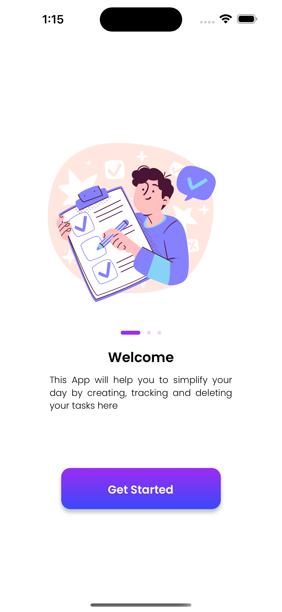
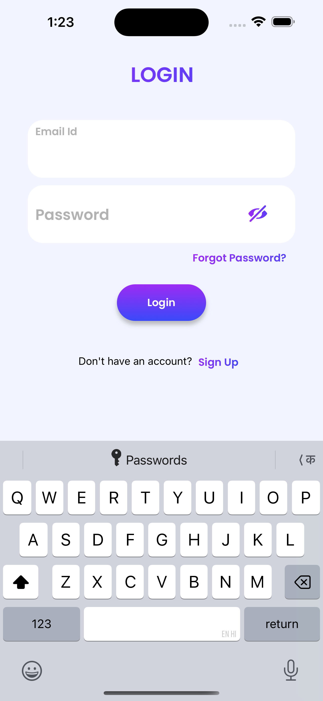
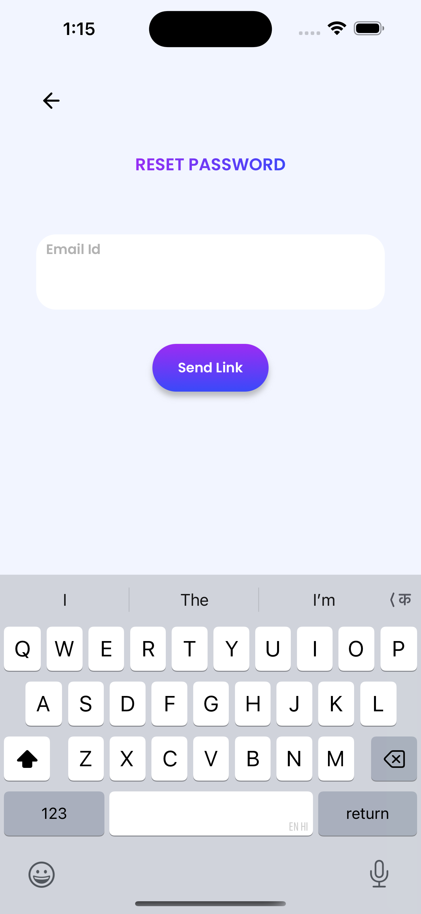
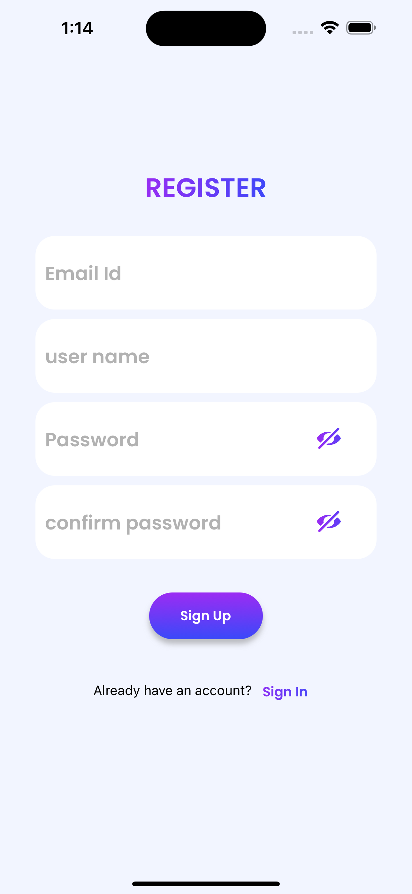
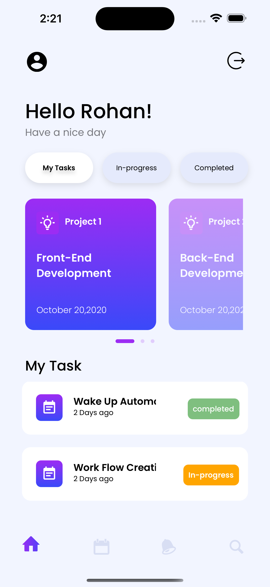
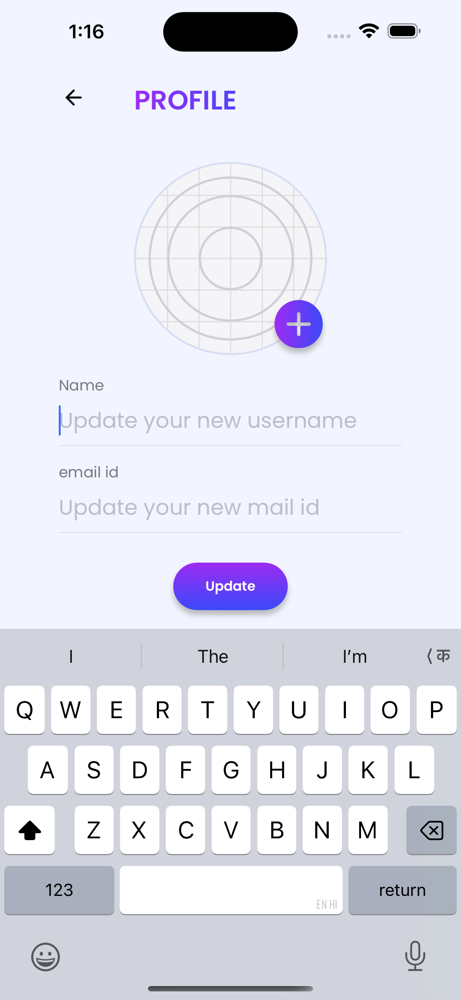
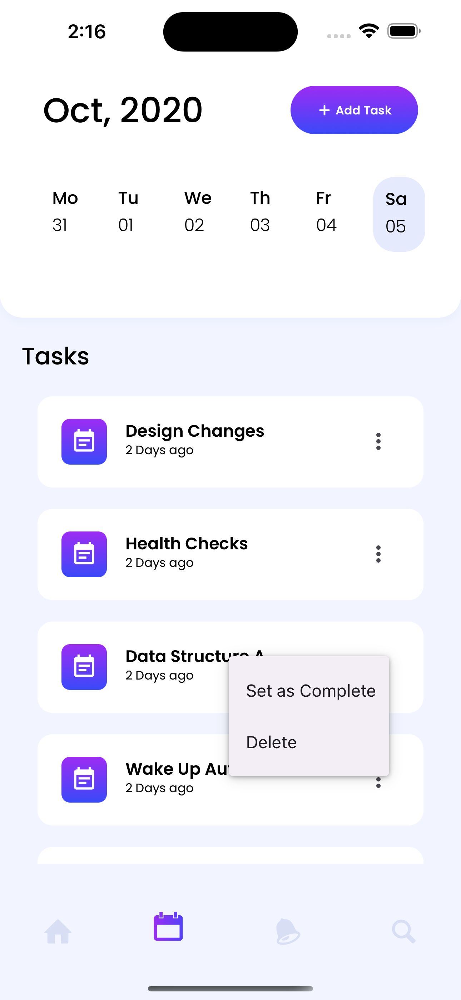

# 📱 Task - Manager (Frontend Only)

This is a personal mobile app built using **Expo with Typescript**.  
It is currently in progress and includes only the **frontend** components. Backend integration will be added in future updates.

---

## 🚀 Features Implemented

- ✅ Built using **React Native with TypeScript**
- ✅ Mobile-friendly and responsive UI
- ✅ Functional screens: Login, Signup, Home, Track, Notification, Search
- ✅ React Navigation for smooth screen transitions
- ✅ Form validations and interactive elements using TypeScript
- ❌ Backend/API integration is pending

---
##  Screenshots
- Find the path of screenshots of the mobile application.

## 🛠️ Tech Stack

- Expo
- TypeScript
- React Navigation
- Stylesheet 
- used UI libraries like react-native-svg, react-native-masked-view,.etc.

---

## 📝 Notes

- The app is not yet deployed to the Play Store.
- Backend services (like authentication or database) are not yet integrated.
- Code is focused on frontend structure, reusability, and clean UI.

---

## 🔜 Future Plans

- Integrate Firebase for backend
- Add authentication (login/signup)
- Push to Play Store after backend is ready

---

## 👨‍💻 Author

**P.H.Naveen Kumar**  
React.js, React Native and Frontend Enthusiast | Transitioning from SQL background  
[LinkedIn] | [GitHub]
