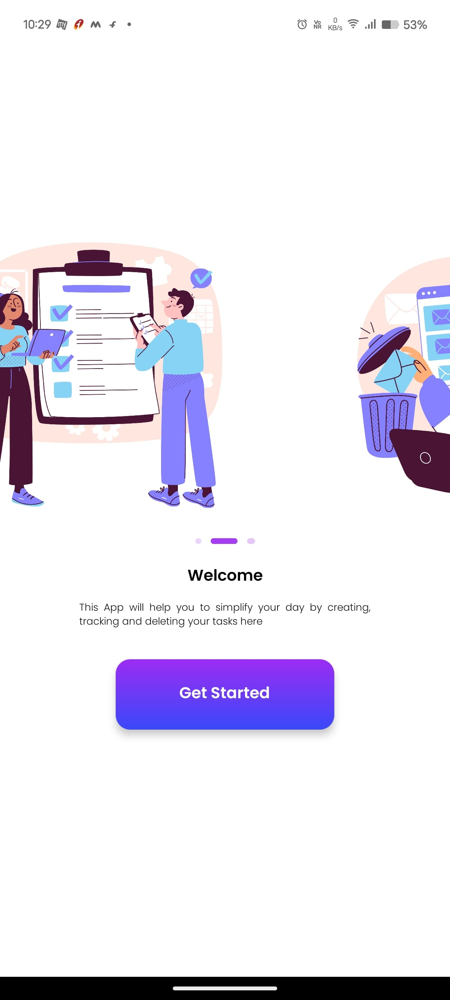
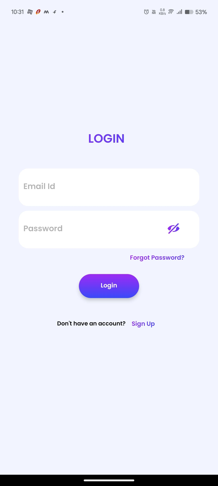
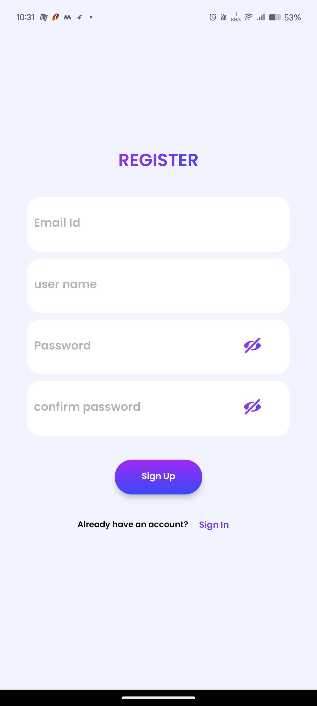
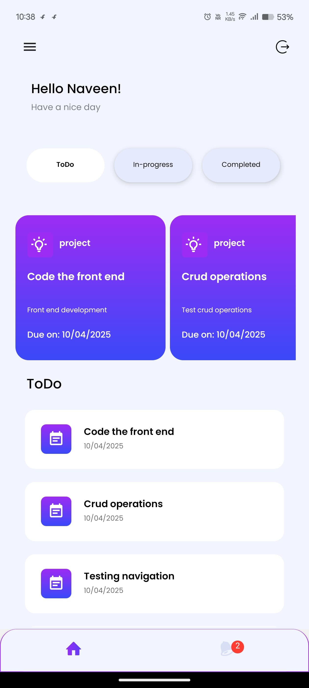
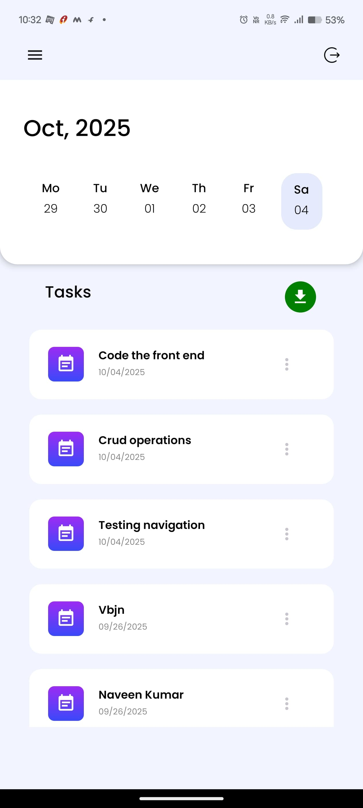
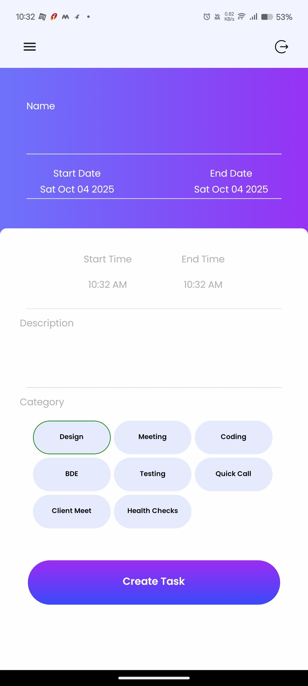
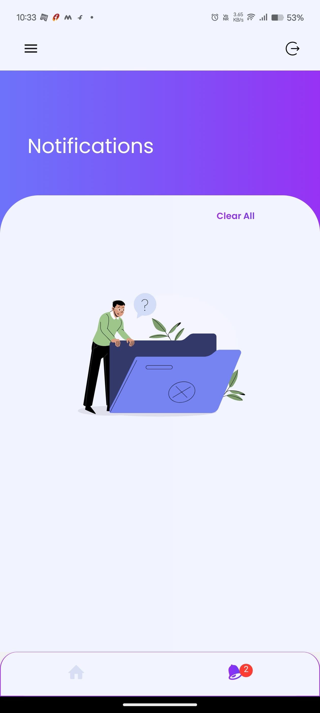
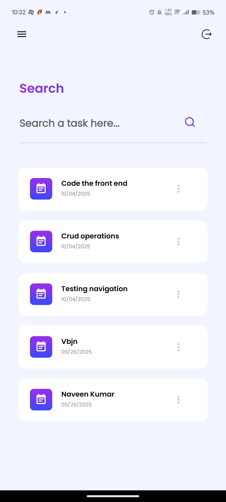
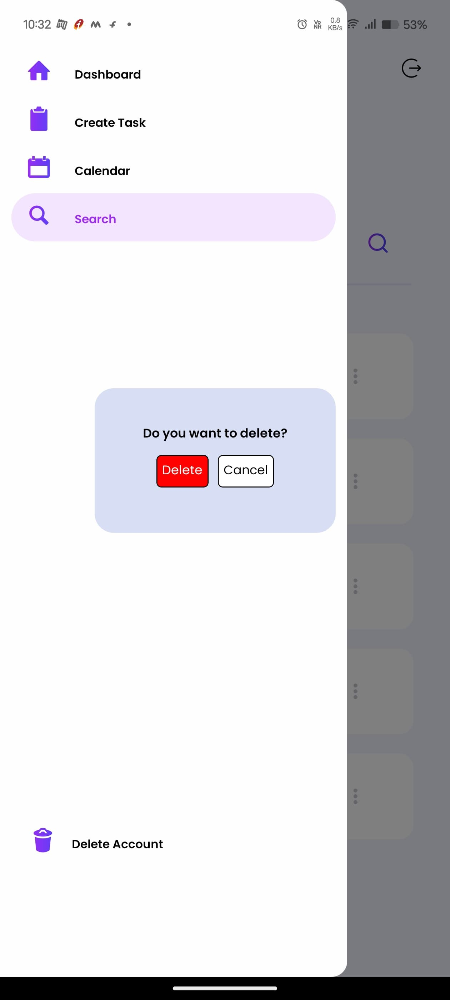

# 📱 Task - Manager

- This is a user-friendly mobile app built using **Expo with Firebase**.  
- This app allow users to **create, track, update and delete** their daily tasks.
- This reminds the users based on tasks scheduled by **push notifications**.
- This has **secure authentication, real-time data synchronization,login persistance and smooth UI** which provides good user experience.

## 🚀 Features Implemented

- ✅ Built using **Expo with TypeScript**
- ✅ Mobile-friendly and responsive UI
- ✅ Functional screens: Open, Login, Reset Password, Signup, Home, Calender, Create Task, Notification, Search
- ✅ React Navigation for smooth screen transitions
- ✅ Form validations and interactive elements using TypeScript
- ✅ Implemented secure user authentication, email verification and password reset functionalities by using FIREBASE
- ✅ Implemented login persistance for making user loggedin until they manually logged out
- ✅ Implemented push notification functionality using expo-notifications
- ✅ Implemented Real-time data synchronization and allow users to download their tasks data in CSV or text file
- ✅ Developed for users to search, track and update their tasks smoothly
- ✅ Ready to deploy the application in Google Play store and App store.
---
##  Screenshots
- Find the path of screenshots of the mobile application.

## 🛠️ Tech Stack

- Expo
- TypeScript
- React Navigation
- Stylesheet 
- used UI libraries like react-native-svg, react-native-masked-view,
- used react native routing packages like @react/navigation-stack, @react/navigation-bottom-tabs, @react/navigation-drawer, react-native-reanimated, react-native-gesture-handler,.etc.
- configured firebase by installing expo npm install firebase.
- configured push notifications by installing expo-notifications, expo-devices and expo-constants.
---

## 📝 Notes

- The app is not yet deployed to the Play Store.
- Front End and Back End have implemented except push-notifications. Implementation of push notifications is in-progress once done, then the app is ready to deploy.
- Code is focused on frontend structure, reusability, and clean UI.
---

## 🔜 Future Plans

- Configure expo-notifications
- Deployment in App Store and Google Play Store.
  
---

## 👨‍💻 Author

**P.H.Naveen Kumar**
Contact [phnaveen2468@gmail.com]
React.js, React Native Developer
[LinkedIn] | [GitHub]
